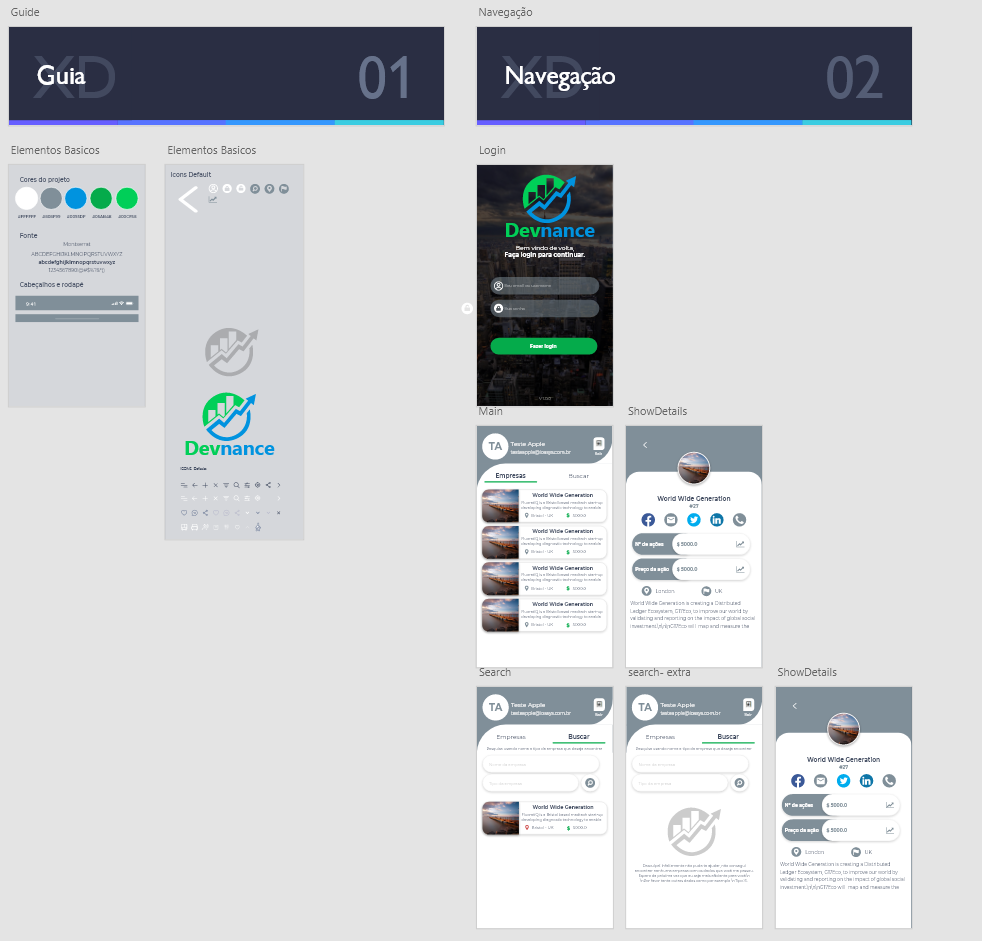
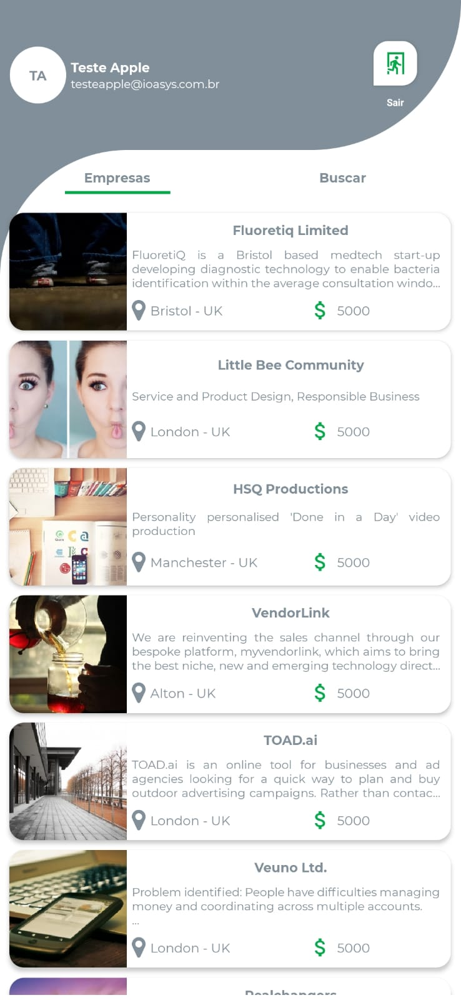
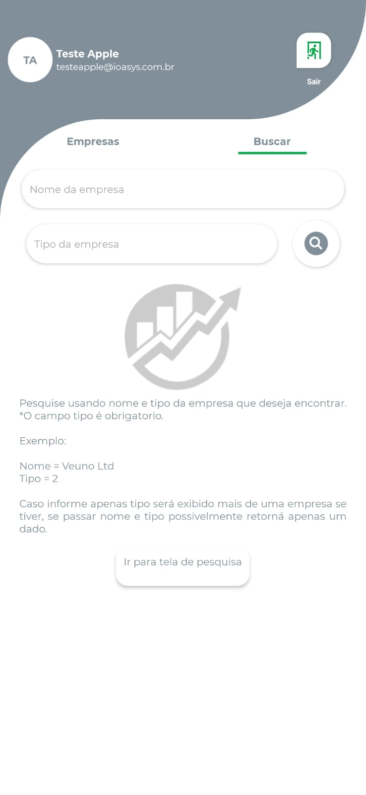
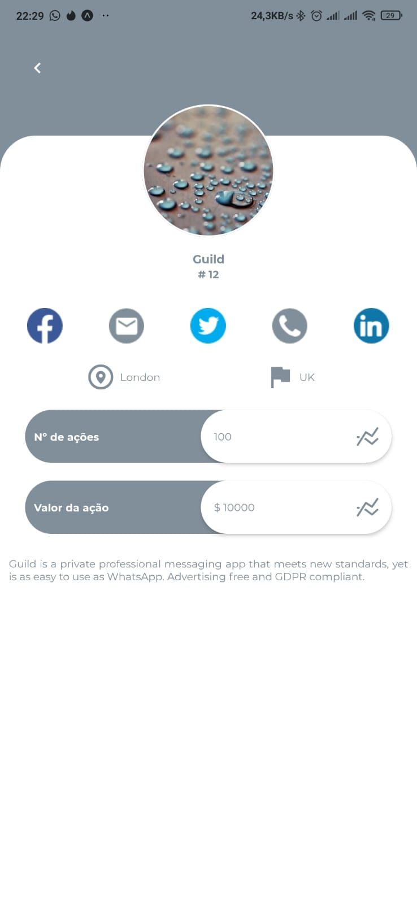

<h1 align="center">Desafio Ioasys </h1>
<h3 align="center">Usando React Native criamos uma aplicação utilizando API disponibilizada.</h3>


## 💻 Desafio  💻
- Desenvolver uma aplicação React Native que consuma a API Empresas, cujo Postman esta compartilhado neste repositório (collection).
- Criar o frontend mobile do zero.
<p align="center">

## 👨🏽‍🏫 Explicação do APP 👨🏽‍🏫
Não foi pedido nenhum tema especifico de app então pude usar a criatividade e criei um app com foco financeiro. 

Foi utilizado o Adobe XD para desenhar a tela e fazer o modelo. 


<p align="center">


</p>


<p align="center">




</p>

<!-- 
- This app was developed using React Naive + Expo.
 
 -->
</p>


##  📚 Bibliotecas 📚

- Expo
Não foi detalhado se era para usar ou CLI ou Expo, porem ultilizei o Bare Workflow que permite que eu execute o codigo nativo e ainda me permite acesso aos recursos do Expo. 

link explicativo.
```sh
https://docs.expo.io/introduction/managed-vs-bare/

```
- React Navigation
Utilizado para fazer a navegação entre as telas. 

link 
```sh
https://reactnavigation.org/

```
- Redux e async storage
Para realizar armazenamento de dados do usuario e para estados globais da aplicação. 


- react-native-tab-view
Utilizado para criar tabs lado a lado.

link 
```sh
https://github.com/satya164/react-native-tab-view

```

- Axios
Utilizado para fazer a requisições a API.

- expo-app-loading
Quanto a aplicação inicia ela carrega os arquivos de font, este componente mantem o usuario na splash ate que promisse seja resolvida.


- expo-font
Utilizado para carregar as fontes personalizadas.


- expo-mail-composer
Utilizado para abrir o app de email e passar os dados para serem enviados.


## 🎩 Reprodução

Um gerenciador de pacotes como o yarn ou npm para baixar as dependências do projeto.


Documentação npm: 

    https://www.npmjs.com/get-npm

Documentação yarn: 

    https://classic.yarnpkg.com/en/docs/install/#windows-stable

Instalar o Expo CLI  

Usando npm para a instalação do Expo
```sh
npm install -g expo-cli
```
Usando npm para a instalação do Expo
```sh
yarn global add expo-cli
```

- Agora so usar Git para clonar o repositório. 
- Executar no terminal:

```sh
$ git clone https://github.com/nathangabriel27/Devnance
```
```sh
$ cd Devnance 
```
```sh
$ sudo expo start
```

- Apos a aplicação executar basta abrir o app da expo e escanear o QR code que a aplicação ira rodar no celular.   


Documentação Expo com os passos 
```sh
 https://docs.expo.io/get-started/installation/

```

## 🐞 BUG 🐞

Depois da aplicação pronta, executei uma serie de testes manuais e percebi que na tab de buscar ocorre um bug com o teclado.
Apos digitar qualquer caracter no imput o teclado é removido automaticamente, olhei na documentação do react-native-tab-view e percebi que tinha uma Issues cadastrada onde outras pessoas tiveram o mesmo problema. 

Link 
```sh
https://github.com/satya164/react-native-tab-view/issues/1181
```

Realizei um comentario para o autor do componente para ajudar ele a reporduzir o erro. 
Criei tambem nessa tela um botão com o texto "ir para a tela de pesquisa". Esta tela é um espelho da tab buscar porem fora da tab, pensei em remover a tab e criar um botão flutuante de pesquisar, so que realmente acho que o app ficou bem bonito com ela. 


<p align="center">

</p>

Thanks 👋🏽!!